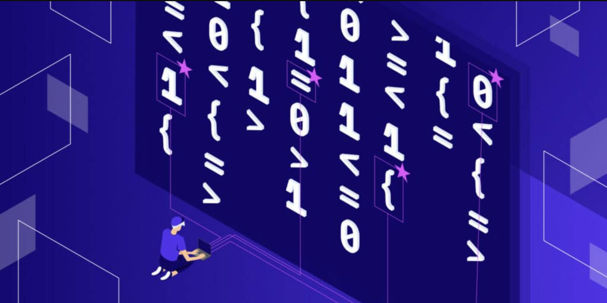

### All Good Things Must Come To An End

ICS 314 has taught me so much in such a short amount of time, it's actually crazy. If you told high school me that he would be learning about software engineering and development techniques, he would laugh in your face! This course was very informative and hands-on, which is very rare for a reverse-classroom type of course (but it works!). I learned so many different techniques like Open Source Software Development and Coding Standards. 

### Don’t Reinvent The Wheel For It Is Not Broken

Open Source Software Development embodies the saying “don’t reinvent the wheel”. Open Source Software Development is a type of software development technique that allows one to use open source code (source code is code that is given to you already from the developer) and manipulate it to study, change, or enhance. You’re essentially given a base that is already functioning where you can let your creativity run wild. An example of this in class is Meteor. Meteor is an open source framework that allows you to build web applications. We utilized this to easily create base applications that we could customize from looks to functionality. I could see myself applying this type of technique in economics by taking other people’s analysis of the economy and building off their work to find new connections using evidence they found. I won’t have to re-do the analysis and collect data since they already did it and it is available to the public. 

### I Actually Have (Coding) Standards

Coding Standards is a really big pain in the butt, but it is one of the most useful tools one could have. Coding standards are a set of rules one must follow in their code from formatting to the functionality of how to access data based on the coding language. It ensures that all developers and coders are on the same page and ensures that code is readable all the time and makes coding a lot more simple. The coding standards we used for Javascript was ESLint. It’s a coding style guideline meant for Javascript code that checks syntax, formatting, code style violations, and potential bugs. It’s very specific where it needs every space and newline to be in place, every curly bracket in order, and imports must be in specific order as well. However, this makes developing in a team much easier as everything must follow this guideline, so all code is understandable even if you never touched it. I could see myself applying this in economics when writing analysis on empirical data and following a set of guidelines to report my data. It's so other economists can understand my data manipulation and understand my analysis, as it follows the standard guidelines of reporting. 

### Fin

This semester has truly been an adventure of ups and downs of using open source software, adhering to coding standards, and many more things that I’ve learned about software development. Using open source software has taught me that I don’t necessarily have to build everything from scratch and to use my available resources; however, even if you are given a base to work with, it won’t be any easier and probably just as difficult if you were to build it from scratch. Adherence to coding standards has now become second nature at this point in my college career and I don't think this concept will ever leave my life as long as I pursue anything in the computer science field. There were some challenges and bumps along the way, but I was able to overcome them and come out on the other side a smarter person. I am forever grateful for taking this class and learning everything that I know now. 
