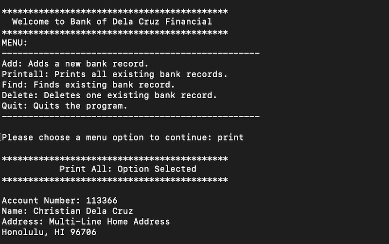

Dela Cruz Banking is a project that I created in ICS212, Fall 2023. It is a banking program that takes user input such as name, account number, and multi-line addresses. It creates a record file filled with each banking entry and saves it to the file. The program utilizes the linked list data structure to store and access these files. It is able to add, delete, print, and find records. Debugging was also a crucial step in creating this program and was used as a tool. Dela Cruz Banking was implemented in the terminal using the progamming language C first, and in the coming weeks, was translated and reimplemented using C++. Within a month-and-a-half, I created a banking program using both C and C++. It is a culmination of what I learned throughout the entire semester such as pointers. 

I created this banking program on my own using the knowledge I gained throughout the semester. I first created pseudocode for multiple functions that the program utilizes. Afterword, I slowly started to implement each function and continuously tested it to ensure fuctionality was intact. The use of AI, such as ChatGPT, was of great help to debug the program. 

This project helped me gain experience in 2 new languages and the use of the MacOS Terminal. I got hands-on experience using a command-line interface using text-based commands on the uhunix servers. I learned a lot about the deeper layers of how a computer stores memory and how code works within the machine. I also learned how important it was to create a debug mode to aid in the debugging process while creating this program. This program and the creation of it taught me how to think like a computer and solve problems from different angles. 

## Source Code of the Database Portion in C++:

<iframe frameborder="0" scrolling="yes" style="width:100%; height:13561px;" allow="clipboard-write" src="https://emgithub.com/iframe.html?target=https%3A%2F%2Fgithub.com%2Fcdc21%2FDelaCruzBanking%2Fblob%2Fe192e3914c5884b88ebe82179043bc1a2fe4bec9%2Fproject2%2Fllist.cpp&style=default&type=code&showBorder=on&showLineNumbers=on&showFileMeta=on&showFullPath=on&showCopy=on"></iframe>

Source: <a href="https://github.com/cdc21/DelaCruzBanking/tree/main/project2">DelaCruzBanking/project2</a>
