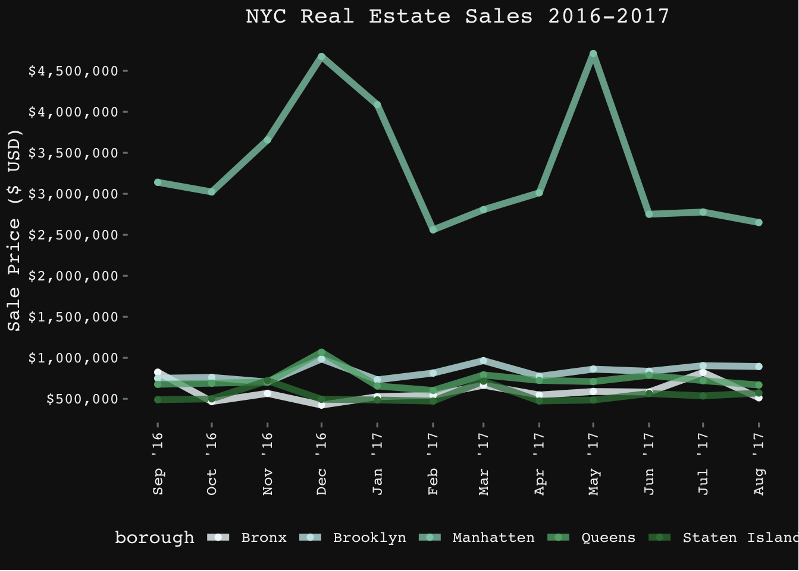

I Heart NY is a data visualization final project I created in ECON256, Spring 2023. Although not an ICS class, ECON256 is an economics class that focused on data visualization of different datasets (such as the census' datasets) utilizing the programming language R. For this final project, I wanted to visualize different housing prices throughout the years in the five different boroughs that make up New York City. So, I took a New York City property sales dataset from Kaggle as my main source to visualize in R. I had to clean the dataset myself by removing any empty observations, selecting columns, reformatting, etc. I then visualized the average housing price in each borough. I also used an animation technique that I learned to animate a line graph representing the average housing price in each borough over a year. I then utilized a prediction technique called ARIMA to show how the ARIMA prediction model works and how accurate it is compared to the real dataset. 

This final project taught me to get creative with my coding and how to best represent data. This project showed me that coding does not have to be boring. It showed that I could have fun while coding and that code does have personality to it. I also learned how to work independently on this coding project but that I am also able to ask for help when needed. I was able to learn a new coding language and new techniques that I find useful for my future endeavors. 

## Source Code: 

 
Source: <a href="https://github.com/cdc21/DataVisualization/blob/089c2ea8ebf35ccf60df93341b20af9f6760835d/Final_Project.Rmd">DataVisualization/Final Project</a>
