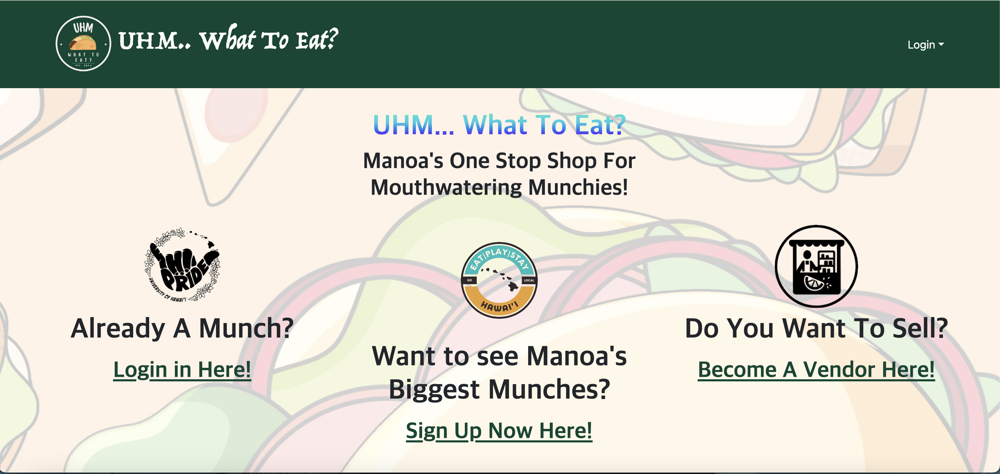
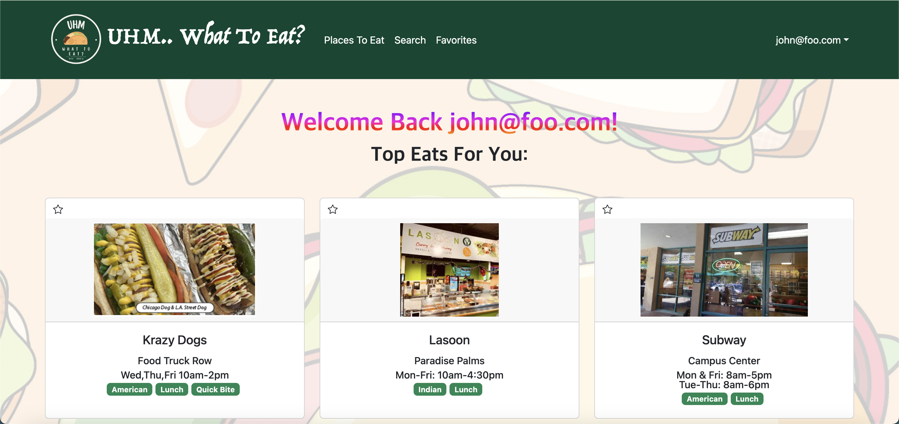
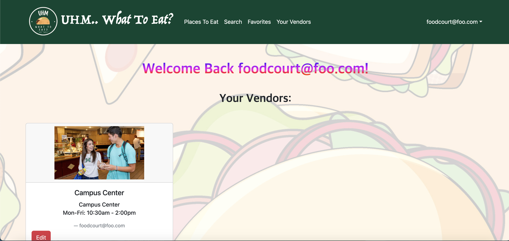

# Overview

UHM...What to eat? is a fun play on words of the University of Hawaii: Manoa’s acronym, UHM, and the age-old question we ask when our stomachs grumble. UHM...What To Eat? is a food application designed to address the many diverse food choices that is on campus. It simplifies the process of finding where food vendors are located and finding specific places with certain food interests. The goal was to solve the question, "Where should I eat today?" and to give students a place to answer it. It also gives vendors access to create their own accounts and help students know where they are located. It's also a place to have a quick overlook of each vendors' menus and take a look of what they offer. Users are also able to favorite vendors they really enjoy to keep up with when the vendors update anything on their page. 

# What I Brought To The Table

The contribution I made towards this project was creating the landing page for when you first log-in, the user landing page, and the vendor landing page. I created a user landing page that would randomize vendors shown to a user so each time they refresh, it would be a different combination of 3 vendors each time. I also created the vendor landing page where it shows all of the vendors that one owns (if they owned more than one). I was also tasked with creating tags/categories for each of the vendors and to implement the functionality for the vendor cards. I had to create mutliple new collections and modify exisiting schemas to create these categories for vendors, so users could know what each vendor were to offer whether they sold burgers, coffee, etc. I also was tasked of making the menu look better instead of just bullet points on the vendor page. Most importantly, I was the one who deployed our application to Digital Ocean, the platform the allows us to publish our application to the world wide web. I bought the server, bought the custom domain name, and had to re-deploy it each time.

# What New Flavors Have I Tasted

I have learned a lot from this experience, from collobarating with people on a team to actually creating a full fledge working website. This was simultaneously the best project I've worked on and the most stressful I've worked on. The reward of seeing something you created was something else. I also learned people don't put in the same effort as you, but I also learned that working with like minded people who try is something only the universe can bless you with. I am very grateful for my teammates who tried to make this project as good as it can be. I also learned the softtware engineering is not as easy as I thought it was because there are so many tiny details that can not be glossed over. If a small detail is glossed over, it could make your entire page crash and then you spend hours debugging something that was solved by just inserting it into the correct collection. Overall, I have gained so much practical experience that I will take with me into the real world.  

# User Landing Page

# Vendor Landing Page

GitHub Page: <a href="https://uhm-what-to-eat.github.io/">UHM...What To Eat? GitHub Organization Page</a>
